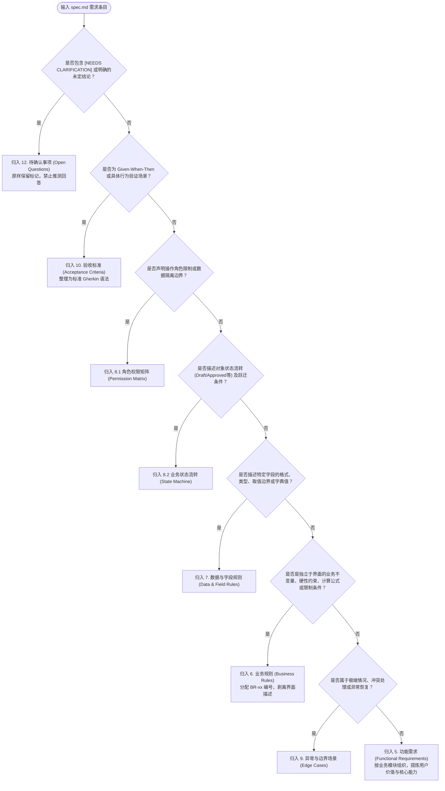

# 需求语义分类与映射准则 (Requirement Classification & Mapping)

在将工程导向的 `spec.md` 转换为产品导向的 PRD 时，最核心的智能动作是对需求语句进行**语义分类 (Semantic Classification)**。

本指南提供结构化的分类决策树、类型定义以及典型转换案例，确保所有输入需求被准确归类至 PRD 的合适章节。

---

## 一、需求语义类型矩阵 (Taxonomy)

| 语义类型 | 核心问题 | 对应 PRD 章节 | 典型标识 / 语气词 | 示例 |
|:---|:---|:---|:---|:---|
| **功能能力 (Functional Capability)** | 用户能做什么？系统提供什么业务能力？ | 第 5 节【功能需求】 | "Users CAN/MUST be able to...", "提供...能力", "允许用户..." | "员工可以提交每日工时报工" |
| **业务规则 (Business Rule)** | 业务有什么硬性不变量与约束限制？ | 第 6 节【业务规则】 | "MUST NOT exceed...", "不可超过...", "超过N天禁止...", "计算公式为..." | "单日累计报工时长不得超过24小时" |
| **数据与字段规则 (Data & Field Rule)** | 数据项的结构、校验、必填与取值范围是什么？ | 第 7 节【数据与字段规则】 | "Field X is required", "Format must be YYYY-MM-DD", "范围0.5~24" | "报工时长必填，最小步长为0.5小时" |
| **权限与范围规则 (Permission Rule)** | 谁在什么条件下有权操作什么范围的数据？ | 第 8 节【权限与状态规则】 | "Only author can...", "Admin CAN view all...", "禁止跨部门访问" | "外包员工仅可查看及操作本人名下工时" |
| **状态生命周期规则 (State Rule)** | 业务对象的流转阶段及前置跃迁条件是什么？ | 第 8 节【权限与状态规则】 | "Draft -> Submitted -> Approved", "当...时变更为已撤回" | "报工单提交后进入待审批状态" |
| **异常与边界场景 (Edge Case)** | 极端条件、并发冲突或业务异常如何兜底？ | 第 9 节【异常与边界场景】 | "If network fails...", "When concurrent updates...", "跨午夜报工" | "跨自然日提交工时时，按工作实际归属日拆分" |
| **验收标准 (Acceptance Criteria)** | 给定具体上下文，某操作产生的确定行为是什么？ | 第 10 节【验收标准】 | "Given ... When ... Then ...", "Acceptance Scenario" | "Given 今天是9月19日 When 提交8小时 Then 记录成功保存" |
| **待确认事项 (Open Question)** | 当前有哪些尚未决断的业务分歧或待澄清点？ | 第 12 节【待确认事项】 | `[NEEDS CLARIFICATION]`, "TBD", "待业务方确认" | "`[NEEDS CLARIFICATION: 是否支持按分钟记录工时]`" |

---

## 二、分类决策树 (Classification Decision Tree)

面对 `spec.md` 中的任意一条需求条目（如 `FR-001`、`Requirement 3`、`Scenario 2`），按以下决策逻辑进行归类：



---

## 三、典型转换模式剖析 (Patterns & Anti-Patterns)

### 案例 1：报工需求分类剖析

假设 `spec.md` 中有如下条目：
```markdown
### Requirements
- FR-001: Users MUST view their own work reports.
- FR-002: Users MUST NOT report more than 24 hours per day.
- FR-003: Historical reports older than N days cannot be modified.
- FR-004: Managers CAN view work reports for all members in their team.
- FR-005: Reports are in 'Draft' until submitted, after which they are 'Submitted'.
- FR-006: [NEEDS CLARIFICATION: N in FR-003 is typically 7 days or 30 days?]
```

#### ❌ 拙劣的转换（简单平铺文本）：
> **功能需求**：
> 1. 查看我的报工
> 2. 一天不能超过24小时
> 3. N天前不能修改
> 4. 经理可以看全员报工
> 5. 报工有草稿和已提交状态
> 6. 确定 N 是7天还是30天（AI自行回答：取30天）

*问题诊断：把业务规则、权限约束、状态跃迁、待确认事项与功能点混为一谈，严重削弱了 PRD 的专业度，且擅自替业务方做决定导致事实源失真。*

#### ✅ 语义升维后的专业转换：
1. **FR-001** ──> **第 5 节【功能需求】 FR-01**:
   - 模块：个人工时管理
   - 能力描述：提供查看个人历史报工明细及统计视图的能力。
2. **FR-002** ──> **第 6 节【业务规则】 BR-01**:
   - 规则名称：单日累计工时上限约束
   - 规则内容：单人在同一自然日（00:00~24:00）内累计所有项目的有效工时不得超过 24.0 小时。
3. **FR-003** ──> **第 6 节【业务规则】 BR-02**:
   - 规则名称：历史报工时效冻结规则
   - 规则内容：距离填报日期超过规定时效（具体天数见待确认项 OQ-01）的历史报工记录进入冻结状态，系统禁止直接编辑与删除。
4. **FR-004** ──> **第 8 节【权限与状态规则】 8.1 角色权限矩阵**:
   - 角色：团队经理（Manager）
   - 权限：本团队成员工时跨度查看权限（只读）。
5. **FR-005** ──> **第 8 节【权限与状态规则】 8.2 业务状态流转**:
   - 状态跃迁：草稿 (Draft) ──[用户点击提交]──> 已提交 (Submitted)。
6. **FR-006** ──> **第 12 节【待确认事项】 OQ-01**:
   - 问题：`[NEEDS CLARIFICATION: 历史报工冻结周期 N 天的具体数值需业务方确定 (候选: 7天 / 30天)]`
   - 影响范围：BR-02 时效判定。

---

## 四、三层分离法则 (The Three-Tier Separation Law)

```text
┌─────────────────────────────────────────────────────────────┐
│ 1. 功能需求 (Functional Capability)                          │
│    "用户能使用什么工具/能力来解决他的问题？"                 │
│    例：用户可以使用工时补录功能登记历史考勤。               │
└──────────────────────────────┬──────────────────────────────┘
                               │ 遵循约束 (Governed by)
                               ▼
┌─────────────────────────────────────────────────────────────┐
│ 2. 业务规则 (Business Rules)                                 │
│    "业务底层的不变量、合法性边界与计算公式是什么？"           │
│    例：单日工时 ≤ 24h；补录期限 ≤ 7天；节假日需双倍系数计算。│
└──────────────────────────────┬──────────────────────────────┘
                               │ 验证行为 (Verified by)
                               ▼
┌─────────────────────────────────────────────────────────────┐
│ 3. 验收标准 (Acceptance Criteria)                            │
│    "在特定上下文执行特定操作，期望的客观业务结果是什么？"   │
│    例：Given 历史已有20h工时, When 尝试补录5h,               │
│        Then 系统阻断并提示'单日已超出24小时上限'。           │
└─────────────────────────────────────────────────────────────┘
```

**三层独立原则**：
1. 修改 UI 布局或操作流程，不应影响业务规则。
2. 调整业务规则阈值（如从 24h 调整为法定 12h），不应迫使重写功能需求说明。
3. 每一条业务规则和功能需求，都应当在验收标准中有至少一个正向或反向测试场景予以覆盖。
